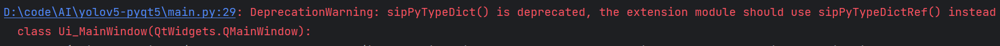
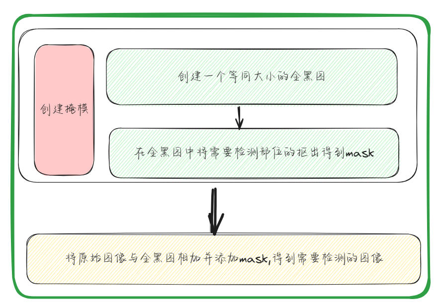
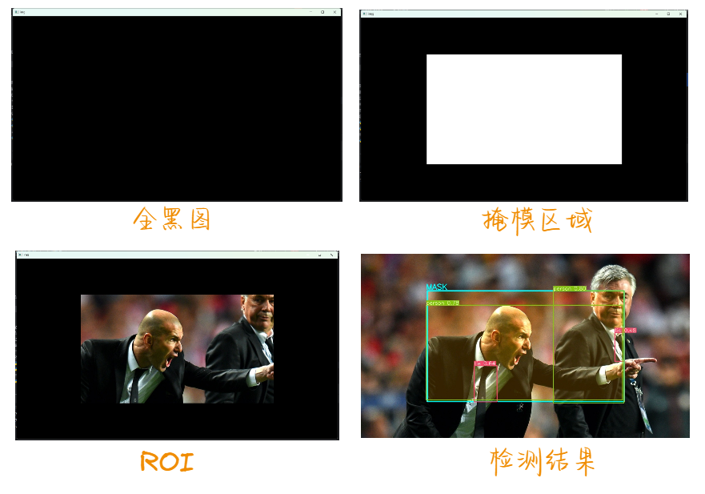
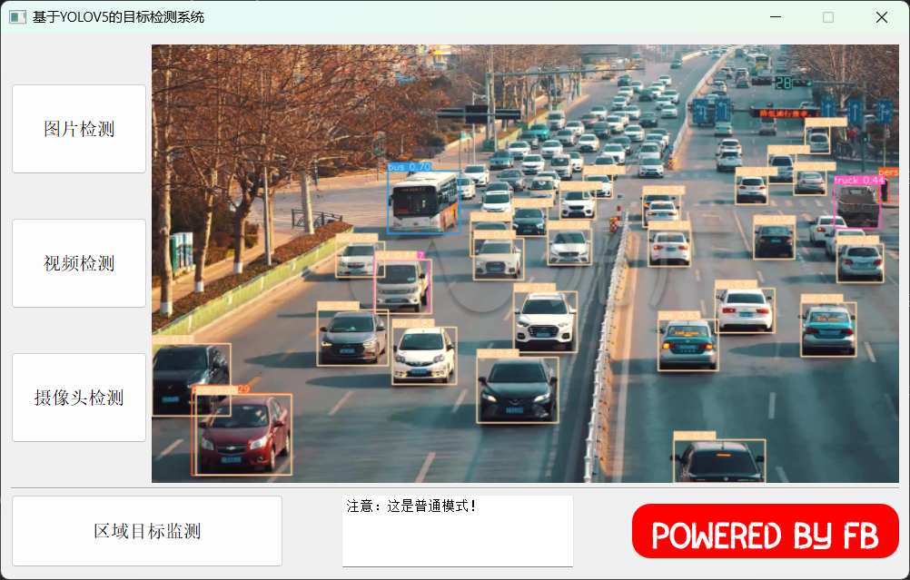
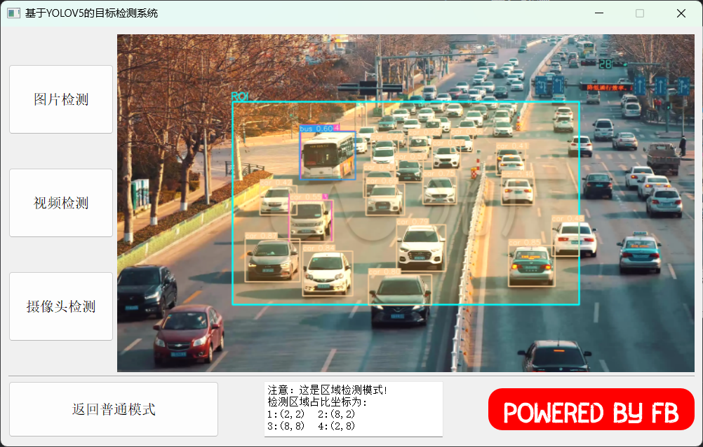

## 基于YOLOV5的目标检测系统
>2023年智能制造系统课设作业


### Feature
1. 两种模式切换
   - 普通检测模式
   - 区域检测模式
 
2. 三种检测方式
   - 图片检测
   - 视频检测
   - 摄像头检测

---

### 代码执行前准备
1、项目中使用YOLOv5的`V5.0`版本，注意下载对应权重文件时需要选择[5.0版本](https://github.com/ultralytics/yolov5/releases/v5.0)

2、项目运行时出现如下错误

！问题原因为旧版本的函数方法弃用，但不影响使用，可忽略。消除警告只需要main.py添加如下代码即可
```py
import warnings
warnings.filterwarnings("ignore", category=DeprecationWarning)
```
3、界面文件是`project.ui`,可使用QTDesigner打开修改

4、环境依赖
```
pip install -r requirements.txt
python main.py
```
---

### 目标区域检测的实现
> **说明：** 以下仅对`图片区域检测`进行说明。视频检测和摄像头检测同理，过程不赘述。

#### 1、思路
要实现对部分区域的检测效果，需要对原始图片不需要检测的部分进行遮挡，然后再进行检测。为实现以下效果，需要以下步骤。

#### 2、具体代码
>代码位置位于本例程的`main.py`文件中的274行
```py
# 对输入的图片设置mask并对输出图片画出mask区域
if self.state:
   hl1 = 2 / 10  # 监测区域高度距离图片顶部比例
   wl1 = 2 / 10  # 监测区域高度距离图片左部比例
   hl2 = 2 / 10  # 监测区域高度距离图片顶部比例
   wl2 = 8 / 10  # 监测区域高度距离图片左部比例
   hl3 = 8 / 10  # 监测区域高度距离图片顶部比例
   wl3 = 8 / 10  # 监测区域高度距离图片左部比例
   hl4 = 8 / 10  # 监测区域高度距离图片顶部比例
   wl4 = 2 / 10  # 监测区域高度距离图片左部比例

   # 输入图片设置mask遮挡
   # mask位置数组
   pts = np.array([[int(img.shape[1] * wl1), int(img.shape[0] * hl1)],  # pts1
                   [int(img.shape[1] * wl2), int(img.shape[0] * hl2)],  # pts2
                   [int(img.shape[1] * wl3), int(img.shape[0] * hl3)],  # pts3
                   [int(img.shape[1] * wl4), int(img.shape[0] * hl4)]], np.int32)
   # 2通道全0数组 ---mask
   mask_black = np.zeros(img.shape[:2], dtype=np.uint8)
   # mask区域设置
   mask_roi = cv2.fillPoly(mask_black, [pts], color=(255, 255, 255))
   # 图片叠加mask
   img = cv2.add(img, np.zeros(np.shape(img), dtype=np.uint8), mask=mask_roi)

   # 对输出结果绘制mask区域
   cv2.putText(showimg, "MASK", (int(showimg.shape[1] * wl1 - 5), int(showimg.shape[0] * hl1 - 5)),
               cv2.FONT_HERSHEY_SIMPLEX,
               1.0, (255, 255, 0), 2, cv2.LINE_AA)
   # 填充mask设置
   # 3通道全0数组
   zeros = np.zeros(showimg.shape, dtype=np.uint8)
   mask = cv2.fillPoly(zeros, [pts], color=(0, 165, 255))
   showimg = cv2.addWeighted(showimg, 1, mask, 0.2, 0)
   # 绘制mask边界
   cv2.polylines(showimg, [pts], True, (255, 255, 0), 3)
```

#### 3、过程图展示



---
### 效果展示
> **说明：** 本例程中测试文件来源于网络,左侧为普通模式，右侧ROI模式

#### 图片检测
<center>
    
    
</center>

#### 视频检测
<center>
    
    
</center>

---
### 参考文献
- https://blog.csdn.net/qq_39740357/article/details/125149010
- https://blog.csdn.net/zcblcz/article/details/121508369
- https://zhuanlan.zhihu.com/p/658876215
- https://blog.csdn.net/m0_58508552/article/details/126196795?csdn_share_tail=%7B%22type%22%3A%22blog%22%2C%22rType%22%3A%22article%22%2C%22