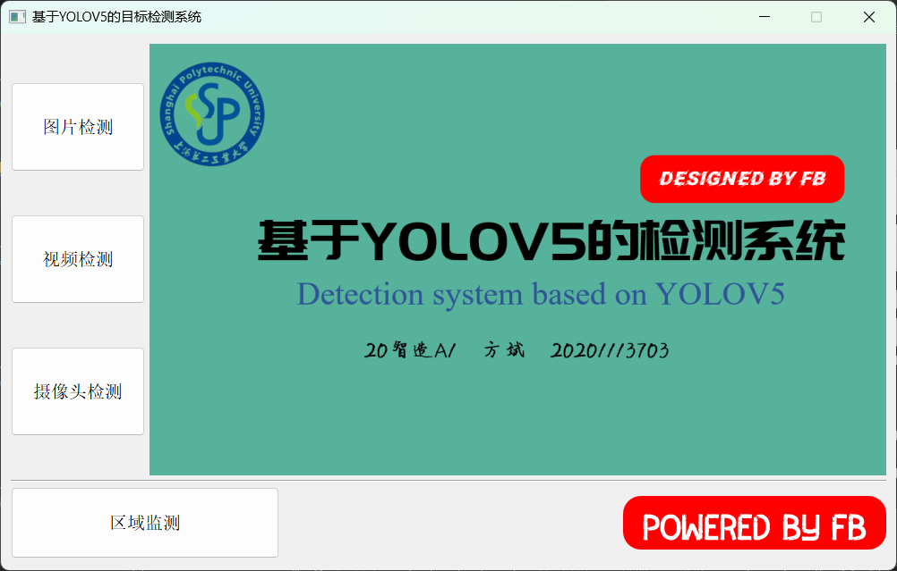
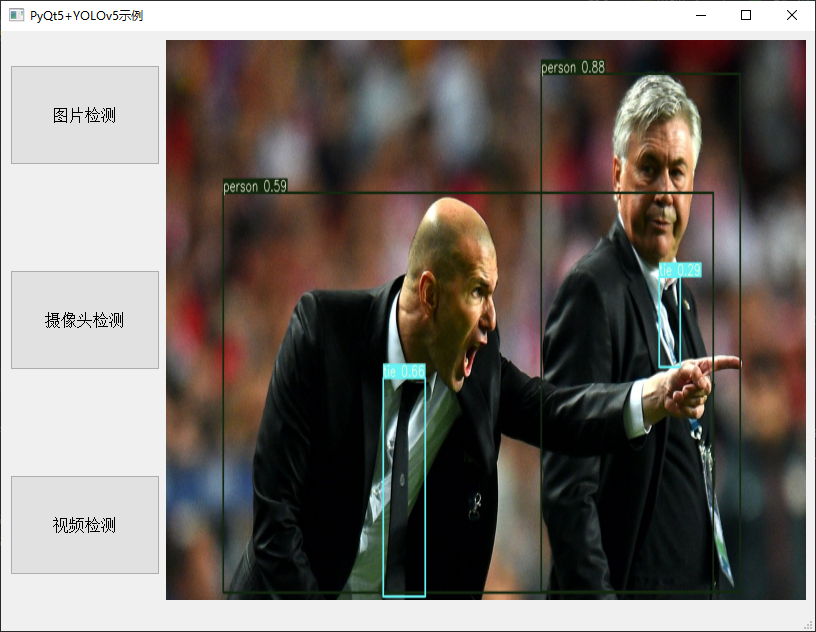

## 基于YOLOV5的目标检测系统
>2023年智能制造系统课设作业

## 代码执行前准备

1、项目中使用YOLOv5的`V5.0`版本，注意下载对应权重文件时需要选择[5.0版本](https://github.com/ultralytics/yolov5/releases/v5.0)

2、界面文件是`project.ui`,可使用QTDesigner打开修改

3、环境依赖
```
pip install -r requirements.txt
python main.py
```


## 代码执行
启动界面


图片检测



视频检测


摄像头检测


图片处理后，预测结果保存在`prediction.jpg`

视频或者摄像头处理后，预测结果保存在`prediction.avi`
